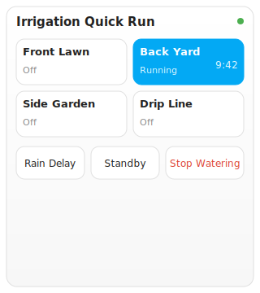

# Rachio Irrigation Card

[![Stable][releases-shield]][releases] [![HACS Badge][hacs-badge]][hacs-link] ![Project Maintenance][maintenance-shield] ![Downloads][downloads] [![GitHub Activity][commits-shield]][commits] [![License][license-shield]](LICENSE) [![Community Forum][forum-shield]][forum]

[commits-shield]: https://img.shields.io/github/commit-activity/y/jpitty03/rachio-irrigation-card.svg
[commits]: https://github.com/jpitty03/rachio-irrigation-card/commits/main
[discord]: https://discord.gg/Qa5fW2R
[discord-shield]: https://img.shields.io/discord/330944238910963714.svg
[forum-shield]: https://img.shields.io/badge/community-forum-brightgreen.svg
[forum]: https://community.home-assistant.io/
[license-shield]: https://img.shields.io/github/license/jpitty03/rachio-irrigation-card.svg
[maintenance-shield]: https://img.shields.io/maintenance/yes/2026.svg
[releases-shield]: https://img.shields.io/github/release/jpitty03/rachio-irrigation-card.svg
[releases]: https://github.com/jpitty03/rachio-irrigation-card/releases/latest
[releases-dev-shield]: https://img.shields.io/github/package-json/v/jpitty03/rachio-irrigation-card/dev?label=release%40dev
[releases-dev]: https://github.com/jpitty03/rachio-irrigation-card/releases
[hacs-badge]: https://img.shields.io/badge/HACS-Default-41BDF5.svg
[downloads]: https://img.shields.io/github/downloads/jpitty03/rachio-irrigation-card/total
[hacs-link]: https://hacs.xyz/

A compact irrigation dashboard card for Home Assistant, designed for
Rachio-style zone control. Works with any on/off Home Assistant entity
(`switch.*`, `input_boolean.*`, and compatible irrigation zone entities).



This card is designed for Rachio-style irrigation dashboards using the
entities that are available with the Rachio integration, but it
does not directly require the Rachio integration. It works with
configurable Home Assistant entities such as `switch.*`,
`input_boolean.*`, or compatible irrigation zone entities.

## Features

- Unified card layout: header, rain status, progress bar, zone grid, action buttons
- N-column zone grid (default 4) with icon, name, location, and status per zone
- Green glowing active state on running zones (timer-based, auto-turns-off when expired)
- Per-zone duration with countdown timer (persists across browser refresh)
- Progress bar showing elapsed/total runtime for the active zone
- Rain status row (Wet/Dry) derived from rain delay entity
- Rain Delay and Standby toggle buttons with live status
- Stop Watering button to turn off all zones at once
- Configurable service actions (`tap_action`, `stop_action`) for Rachio-specific services
- Layout options (columns, compact mode, show status/timer)
- Visual editor (no YAML required) for all common config fields
- Card picker registration (add from dashboard editor, no YAML needed)
- Theme-aware styling using HA CSS variables throughout
- Graceful handling of missing entities
- Config validation with clear error messages
- Designed for Rachio, but not tied to the Rachio integration

## Requirements

- Home Assistant 2024.8.0 or newer
- HACS (recommended) for installation
- One or more on/off entities representing irrigation zones
  (e.g. `switch.*` from the Rachio integration, or `input_boolean.*`
  for testing)

## Installation

### HACS Custom Repository Installation

1. In Home Assistant, open HACS.
2. Click the three-dot menu (top right) → **Custom repositories**.
3. Add this repository's GitHub URL.
4. Select type: **Dashboard**.
5. Click **Add**, then install "Rachio Irrigation Card".
6. Add the resource if HACS does not prompt you to:
   - Settings → Dashboards → Resources → Add Resource
   - URL: `/hacsfiles/rachio-irrigation-card/rachio-irrigation-card.js`
   - Type: `JavaScript Module`
7. Refresh your dashboard.

### Manual Installation

1. Download `rachio-irrigation-card.js` from the latest GitHub release.
2. Copy it to your HA `/config/www/` directory.
3. Settings → Dashboards → Resources → Add Resource
   - URL: `/local/rachio-irrigation-card.js`
   - Type: `JavaScript Module`
4. Refresh your dashboard.

> **Note:** Do NOT switch `lovelace.resource_mode` to `yaml` to add
> resources — that hides all UI-managed resources and breaks other
> custom cards. Use the Resources button on the **Settings → Dashboards**
> list page instead (enable Advanced Mode in your profile if the button
> is missing).

## Configuration

Add a card to any dashboard (edit mode → Manual card, or raw config
editor):

```yaml
type: custom:rachio-irrigation-card
title: Irrigation Quick Run
default_duration: 10
show_timer: true
zones:
  - name: Zone 1
    location: Front Lawn
    entity: switch.rachio_front_lawn
    duration: 10
  - name: Zone 2
    location: Back Yard
    entity: switch.rachio_back_yard
    duration: 15
rain_delay_entity: switch.rachio_rain_delay
standby_entity: switch.rachio_standby
```

### Visual editor

The card ships with a built-in visual editor (no YAML required). In
dashboard edit mode, click **Configure** on the card to edit the title,
default duration, per-zone name/entity/duration, add or remove zones,
optional rain delay and standby entities, and layout options
(columns, compact, show status, show timer). Changes are saved live to
the dashboard.

The card also registers itself with the Home Assistant card picker, so
you can add it directly from the dashboard editor (Edit dashboard →
Add Card → search "Rachio Irrigation Card") instead of pasting YAML.

### Options

| Field                | Type    | Required | Default                | Description                                          |
| -------------------- | ------- | -------- | ---------------------- | ---------------------------------------------------- |
| `type`               | string  | yes      | -                      | Must be `custom:rachio-irrigation-card`.             |
| `title`              | string  | no       | `Irrigation Quick Run` | Card header text.                                    |
| `zones`              | list    | yes      | -                      | List of zone controls (see below).                   |
| `default_duration`   | number  | no       | `10`                   | Minutes used when a zone omits `duration`.           |
| `show_timer`         | boolean | no       | `true`                 | Show the countdown on running zones.                 |
| `rain_delay_entity`  | string  | no       | -                      | Entity toggled by the Rain Delay button.             |
| `standby_entity`     | string  | no       | -                      | Entity toggled by the Standby button.                |
| `stop_action`        | action  | no       | -                      | Override the Stop Watering service call.             |
| `layout`             | map     | no       | -                      | Layout options (see below).                          |

### Zone options

| Field        | Type   | Required | Default                            | Description                                        |
| ------------ | ------ | -------- | ---------------------------------- | -------------------------------------------------- |
| `entity`     | string | yes      | -                                  | Any on/off HA entity.                              |
| `name`       | string | no       | entity `friendly_name` or `entity` | Display label for the zone button.                 |
| `duration`   | number | no       | `default_duration` or `10`         | Run duration in minutes.                           |
| `location`  | string | no       | -                                  | Secondary label (e.g. "Front Yard").               |
| `icon`       | string | no       | -                                  | Optional `mdi:` icon for the zone button.        |
| `tap_action` | action | no       | -                                  | Override the toggle service call for this zone.    |

### Action format

`tap_action` and `stop_action` use this shape:

```yaml
tap_action:
  service: switch.turn_on
  data:
    entity_id: switch.rachio_zone_1
```

If `tap_action` is omitted, the card toggles the entity with
`turn_on`/`turn_off` based on its current state. If `stop_action` is
omitted, Stop Watering loops `turn_off` over all zones.

### Layout options

```yaml
layout:
  columns: 4
  compact: true
  show_status: true
  show_timer: true
```

| Field         | Type    | Default | Description                                               |
| ------------- | ------- | ------- | --------------------------------------------------------- |
| `columns`     | number  | `4`     | Zone grid columns (clamped to 1–6).                       |
| `compact`     | boolean | `false` | Tighter padding; hides status text.                       |
| `show_status` | boolean | `true`  | Show "Running"/"Off" text on zone buttons.                |
| `show_timer`  | boolean | `true`  | Override top-level `show_timer` for timer visibility.     |

## Example: Local Test with input_boolean

For testing without Rachio hardware, add to `configuration.yaml`:

```yaml
input_boolean:
  rachio_zone_1:
    name: Rachio Zone 1
  rachio_zone_2:
    name: Rachio Zone 2
  rachio_zone_3:
    name: Rachio Zone 3
  rachio_zone_4:
    name: Rachio Zone 4
  rachio_rain_delay:
    name: Rachio Rain Delay
  rachio_standby:
    name: Rachio Standby
```

Then use this card config:

```yaml
type: custom:rachio-irrigation-card
title: Irrigation Quick Run
zones:
  - name: Zone 1
    entity: input_boolean.rachio_zone_1
    duration: 10
  - name: Zone 2
    entity: input_boolean.rachio_zone_2
    duration: 10
rain_delay_entity: input_boolean.rachio_rain_delay
standby_entity: input_boolean.rachio_standby
```

## Example: Rachio

```yaml
type: custom:rachio-irrigation-card
title: Irrigation Quick Run
zones:
  - name: Front Yard
    entity: switch.rachio_front_yard
    duration: 10
  - name: Back Yard
    entity: switch.rachio_back_yard
    duration: 10
```

Entity names vary by Rachio setup — use your own entity IDs from
Settings → Devices & Services → Rachio.

## Example: Custom service actions

```yaml
type: custom:rachio-irrigation-card
title: Irrigation Quick Run
zones:
  - name: Front Yard
    entity: switch.rachio_front_yard
    duration: 10
    tap_action:
      service: switch.turn_on
      data:
        entity_id: switch.rachio_front_yard
stop_action:
  service: rachio.stop_watering
```

## Troubleshooting

| Symptom | Fix |
| ------- | --- |
| "Custom element doesn't exist" | Resource not added or wrong type — must be `JavaScript Module`, not `JavaScript`. |
| Other custom cards break after adding resources | You switched `resource_mode: yaml` — that hides UI-managed resources. Revert to `storage`; add resources via the UI Resources button instead. |
| Card loads but buttons do nothing | Check the entity IDs exist in Developer Tools → States. |
| Stale JS after an update | Hard-refresh the browser (`Ctrl+Shift+R`) or bump the resource URL `?v=2`. |
| "requires a zones array" | `zones:` must be a YAML list (each entry starts with `-`). |
| Timer resets on refresh | Should not happen in v0.2.0+ (localStorage persistence). Check browser dev tools for localStorage errors. |

## Development

```sh
npm install
npm run dev        # watch build to dist/
npm run build      # one-shot build
npm run typecheck  # TypeScript checks
npm test           # unit tests
```

### Local deploy to Home Assistant

Build and copy the card directly to your HA instance via WinSCP, no
GitHub round-trip needed:

```sh
npm run deploy
```

This reads connection details from a `.env` file (gitignored). Copy
`.env.example` to `.env` and fill in your HA SSH credentials:

```sh
cp .env.example .env
# Edit .env and set HA_PASS to your HA password
```

After deploying, hard-refresh your browser (Ctrl+Shift+R).

### Release a new version

Build, test, commit, push, tag, and create a GitHub release in one
command. The release workflow automatically builds and attaches the
JS asset to the release.

```sh
npm run release              # patch bump (0.4.1 -> 0.4.2)
npm run release minor        # minor bump (0.4.1 -> 0.5.0)
npm run release major        # major bump (0.4.1 -> 1.0.0)
```

Release notes are auto-generated from commit messages since the last
tag. Edit them afterwards on the GitHub release page if needed.

### Manual testing without scripts

Copy `dist/rachio-irrigation-card.js` to your HA `/config/www/`
directory (via SCP, Samba share, or the File editor add-on), then add
the resource `/local/rachio-irrigation-card.js` (type: JavaScript
Module) in Settings -> Dashboards -> Resources.

## Roadmap

- v0.1.0 — basic card, generic entity support, local timer, HACS install
- v0.2.0 — configurable service actions, localStorage timer, layout options, validation
- v0.3.0 — visual card editor, entity pickers, card picker registration
- v0.4.0 — unified card redesign: header, rain status, progress bar, zone locations, green glowing active zones
- v1.0.0 — stable config schema, full Rachio examples, test coverage

## License

MIT
